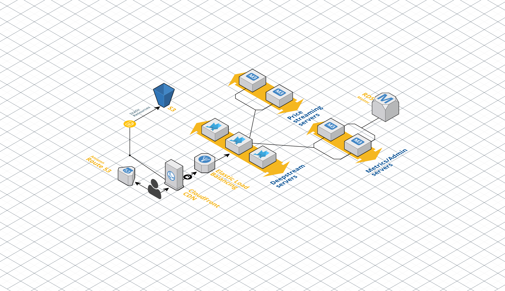

### Akka and Deepstream together

A simple example repository showing integration with Akka and Deepstream, this repository consists of a front end interface with a Deepstream client and some simple back end micro services built with Akka and Deepstream. One of the micro-services provides (mock) financial data while the other handles purchases of stocks. In reality there are many different services you could run other than these, such as admin functionality or metrics collection.

In production, at its simplest it could look as follows:

Each customer has a deepstream client in their browser which connects to a load balanced deepstream cluster. Behind the Deepstreams we have two micro service clusters:

1. A cluster of Akka nodes providing price updates to the Deepstreams. The actual updates are sent via a normal Deepstream client using `listening`, a concept where updates only need to be provided when we have interested clients. With the front end we're able to indicate which prices we're interested in dynamically so that only these will be sent

2. A cluster of Akka nodes handling purchases of stocks. To showcase failure and success scenarios, every second purchase will fail with a red flash of the row. Each successful purchase will give a green flash.

### How to run

##### Back end

The back end micro services were built using Scala and as suc
