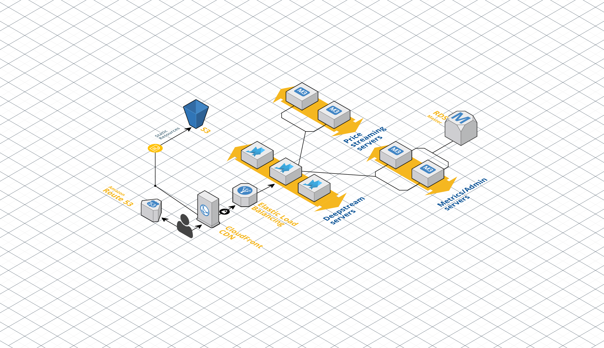

### Akka and Deepstream together

In many regards Akka and deepstream are quite similar, they both enable building highly available, scalable and fault tolerant applications. Akka achieves this by using a battle tested supervisor hierarchy where errors are only propagated as high as necessary through the tree of nodes. This means that each node knows how to deal with a child failing and can then remedy the state by spawning a new child node or or by sending messages to a failover child. Deepstream accomplishes this by clustering nodes for failover as well as availability. Functionality is then added by connecting client processes which can provide endpoints via RPCs, provide data to interested clients via listening and consume data via subscriptions.

This repository consists of a simple example showing how to integrate Deepstream and Akka. We have a front end interface with a Deepstream client and some simple back end micro services built with Akka and Deepstream. One of the micro-services provides (mock) financial data while the other handles purchases of stocks. In reality there are many different services you could run other than these, such as admin functionality or metrics collection.

In production, at its simplest it could look as follows:



Each customer has a deepstream client in their browser which connects to a load balanced deepstream cluster. Behind the Deepstreams we have two micro service clusters:

1. A cluster of Akka nodes providing price updates to the Deepstreams. The actual updates are sent via a normal Deepstream client using `listening`, a concept where updates only need to be provided when we have interested clients. With the front end we're able to indicate which prices we're interested in dynamically so that only these will be sent. It's important to note that either Deepstream records or events can be used to stream these price updates, we've opted for events as we don't need the prices to be persisted anywhere, however if we wanted to support snapshots of data we could use records.

2. A cluster of Akka nodes handling purchases of stocks. This represents the request-response functionality of Deepstream with exactly once delivery, something crucial for things like purchases. To showcase failure and success scenarios, every second purchase will fail with a red flash of the row. Each successful purchase will give a green flash.

### How to run

##### Deepstream

The first thing that needs to start in this architecture is the Deepstream server. You can download this off npm, clone it from GitHub or download the binary. For simplicity we'll be downloading it from npm.

```
\> npm install -g deepstream.io
\> deepstream
      _                     _
   __| | ___  ___ _ __  ___| |_ _ __ ___  __ _ _ __ ____
  / _` |/ _ \/ _ \ '_ \/ __| __| '__/ _ \/ _` | '_ ` _  \
 | (_| |  __/  __/ |_) \__ \ |_| | |  __/ (_| | | | | | |
  \__,_|\___|\___| .__/|___/\__|_|  \___|\__,_|_| |_| |_|
                 |_|
 =====================   starting   ======================
```

##### Back end

The back end micro services were built using Scala and as such you should be able to run them using sbt as follows:

```
\> git clone git@github.com:deepstreamIO/akka-deepstream-integration.git
\> cd akka-deepstream-integration
\> ./sbt
...
...
...
...\> run
```

##### Front end

The web interface is self contained and relies on CDNs for dependencies. You should just be able to open the `index.html` file in a browser of your choice.
